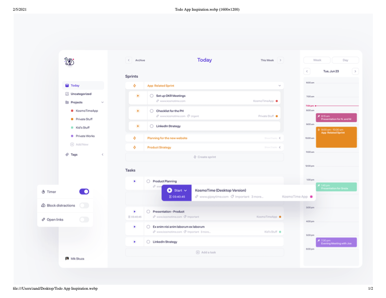

# Data/UI modeling in Fulcro: Project Tasks App

Let's try to create this app:

## Analysis questions

1. What is the shape of the UI? => LeftPane with SprintsListItem etc., MiddlePane with SprintsListDetails, ...
2. What are the data entities and graph? => Sprints (with both detail and list item attributes), ...
3. How do they map to each other and how to express it with Fulcro idents, queries, and extra graph edges? +
   => You might need to add extra _edges_ and structure on top of the data entities to make them fit your UI.
4. What server-side resolvers do we have / need? Related to how we want to load the data - all at once, piecemeal, or on-demand (w.r.t. the details).
+
TIP: It might be easier not to worry about data loading at first, just assume the data entities the UI needs have been loaded somehow.

## Possible defsc structuring

1. All are siblings (b/c that is the UI we want)
+
--
   * Root
   ** Menu
   ** MenuItemDetails (= Today|TaskList)
   ** Calendar
--
+
.. Variant: Root queries directly for individual lists and we use Pathom placeholders to add the extra UI structure for the list item vs details components:
   `[{:>/sprints-item (get-query SprintsItem)} {:>/sprints-details (get-query SprintsDetails)} ...]` = `[:sprints-list/label, {:sprints-list/sprints [..]}  ...]`
.. Variant: TODO: ...
2. Shared parent for selector + detail (similar to 1. but with extra structure to group the two summary-details views):
   * Root
   ** TaskLists
   *** Menu
   *** MenuItemDetails
   ** Calendar
3. Other options: Use union queries / dynamic queries so we only query for the details we need...

### Decision

The simplest is to use 1.1, i.e. most of the data is directly under Root, b/c that corresponds most closely to the natural way to structure the data entities.

But the UI needs more structure - e.g. put projects and tags under Menu, all-tasks under TaskList. We leverage Pathom's placeholders (`:>/arbitrary-made-up-key`) to introduce the extra level of structure. (If we create the data on the frontend, we need to introduce this artificial structure ourselves.)

To load the data from Pathom, we might either load them individually and in parallel or make convenience grouping resolvers, e.g. `{:task/filters {:tags [..] :projects [..]}` - we would then need to adjust the UI accordingly or use data targeting / custom post-mutation to relocate the data where we want them. (In this case the simplest is to modify Menu to query for the whole `:task/filters` and pluck tags and projects from that.)